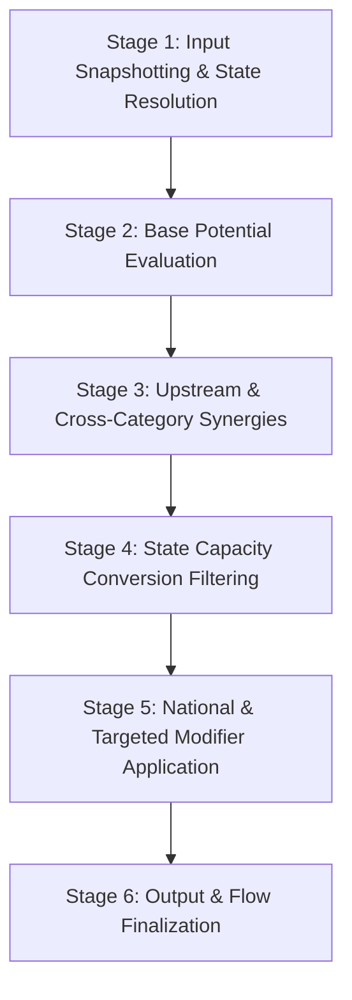

# ADR-0006: National Yield Calculation Rules Specification

## Status
Accepted (Specification Only)

## Context
Across Steps 1 to 4B, Republic established:
- The canonical design and core loop ([ADR-0001](file:///c:/Users/WALE/Republic%20-%20Game/Republic-Game/Docs/Architecture/Decisions/ADR-0001-canonical-delivery-model.md)).
- The authoritative global simulation clock in West Africa Time ([ADR-0002](file:///c:/Users/WALE/Republic%20-%20Game/Republic-Game/Docs/Architecture/Decisions/ADR-0002-global-simulation-clock.md)).
- Sovereign country identity and immutable founding moments ([ADR-0003](file:///c:/Users/WALE/Republic%20-%20Game/Republic-Game/Docs/Architecture/Decisions/ADR-0003-country-identity-and-founding-state.md)).
- The National Yield domain model across 14 canonical categories ([ADR-0004](file:///c:/Users/WALE/Republic%20-%20Game/Republic-Game/Docs/Architecture/Decisions/ADR-0004-national-yield-domain-model.md)).
- The National Yield calculation input contract and modifier model ([ADR-0005](file:///c:/Users/WALE/Republic%20-%20Game/Republic-Game/Docs/Architecture/Decisions/ADR-0005-national-yield-calculation-inputs.md)).

Before implementing the calculation engine in production code, this document establishes the **formal architectural specification** governing how National Yield calculations must function.

> [!IMPORTANT]
> **Specification-Only Scope Boundary**:
> This document defines architectural rules, dependency flows, stages, and semantic contracts.
> It deliberately does **not** implement production calculation code, invent arbitrary numerical weights, pick final conversion ratios, execute yield cycles, or generate REPU.

---

## 1. What Is Being Calculated?

A central design failure of traditional nation-building games is treating all national outputs as a homogeneous pool of convertible points. Republic explicitly rejects this.

The calculation engine evaluates three fundamentally different concepts:

```
┌────────────────────────────────────────────────────────────────────────┐
│                        SOVEREIGN EVALUATION HIERARCHY                  │
├────────────────────────────────────────────────────────────────────────┤
│ 1. INSTANTANEOUS CAPACITY (Stock / Potential)                          │
│    - What the nation is currently capable of sustaining or executing.  │
│    - Examples: Industrial Capacity, Military Readiness,                │
│                Administrative Capacity, Infrastructure Density.        │
│    - Nature: Non-consumable operational ratings (NOT money).           │
├────────────────────────────────────────────────────────────────────────┤
│ 2. PERIODIC FLOW / OUTPUT (Rate over Time)                             │
│    - What is generated or realized per unit of simulation time (dt).   │
│    - Examples: REPU Treasury Revenue (R/period),                       │
│                Research Output (patents/period), Raw Resource Output.  │
│    - Nature: Dynamic rate of generation.                               │
├────────────────────────────────────────────────────────────────────────┤
│ 3. ACCUMULATED STOCK / BALANCE (Integrated Total)                      │
│    - Liquid reserves accumulated over time (∫ Flow dt).                │
│    - Primary Example: Sovereign Treasury Balance in REPU (R).          │
│    - Nature: Consumable spending power.                                │
└────────────────────────────────────────────────────────────────────────┘
```

### Key Distinctions
1. **National Yield**: The holistic productive, human, institutional, and strategic capacity of the sovereign country.
2. **Individual Categories (14)**: Dedicated capability metrics representing distinct national subsystems.
3. **REPU Treasury Revenue**: The **only** monetary output category. It represents fiscal revenue generated by the formal economy, state enterprises, tariffs, and sovereign assets denominated in REPU (`R`).
4. **Treasury Balance**: The cumulative liquid financial balance held by the sovereign state. REPU Treasury Revenue flows into the Treasury Balance during yield cycles; National Yield itself is not money.
5. **Food Exclusion**: Food is strictly an emergent output of the civilian economy (farmers + businesses + infrastructure + energy + policy + markets), **not** a direct yield category.

---

## 2. Category-to-Input Influence Mapping

The following mapping defines which inputs from [`NationalYieldCalculationInputs`](file:///c:/Users/WALE/Republic%20-%20Game/Republic-Game/src/Republic.Core/NationalYield/NationalYieldCalculationInputs.cs), country state, and institutional systems inform each of the 14 categories. Final numerical coefficients belong to subsequent engine steps.

| # | National Yield Category | Primary Direct Inputs | Secondary / Indirect Influences | State Capacity / Institutional Modifiers |
|---|-------------------------|-----------------------|---------------------------------|------------------------------------------|
| 1 | **REPU Treasury Revenue** | Economic Capacity, Financial Capacity, Trade Volume | Infrastructure Condition, Human Capital, Natural Resource Output | Government Effectiveness (tax collection efficiency), Political Stability, Cabinet (Finance) |
| 2 | **Industrial Capacity** | Baseline Industrial Base, Energy Capacity | Infrastructure Condition, Natural Resource Output, Human Capital | Administrative Capacity, Science/Technology adoption, Cabinet (Infrastructure) |
| 3 | **Energy Capacity** | Power Plants, Grid Infrastructure, Fuel Output | Natural Resource Output (hydrocarbons, uranium), Technology | Infrastructure Condition, Environmental Regulations, Cabinet (Energy/Infrastructure) |
| 4 | **Infrastructure Capacity** | Transport Networks, Deepwater Ports, Rail Corridors | Industrial Capacity, Capital Investment | Administrative Capacity (maintenance bandwidth), Public Works Efficiency |
| 5 | **Financial Capacity** | Domestic Banking Capitalization, Sovereign Credit | Political Stability, Trade Volume, Currency Stability | Institutional Rule of Law, Corruption Perception, Cabinet (Finance) |
| 6 | **Human Capital** | Education Systems, Healthcare Quality, Demographics | Public Infrastructure, Food Security, Sanitation | Administrative Capacity (service delivery), Social Cohesion |
| 7 | **Science Capacity** | Academic Institutions, R&D Labs, Patent Base | Human Capital, Financial Investment | Freedom of Inquiry, Intellectual Property Protections, Cabinet (Science/Education) |
| 8 | **Innovation Capacity** | Commercial Tech Adoption, Entrepreneurial Activity | Science Capacity, Financial Capital Liquidity | Regulatory Modernism, Bureaucratic Red Tape (friction), Market Competition |
| 9 | **Administrative Capacity** | Civil Service Meritocracy, Bureaucratic Scale | Infrastructure (digital/telecom), Education Level | Anti-Corruption Strength, Government Effectiveness, Cabinet Competence |
| 10 | **Security Capacity** | Law Enforcement Personnel, Police Infrastructure | Political Stability, Human Capital | Judicial Independence, Rule of Law Enforcement, Cabinet (Interior) |
| 11 | **Intelligence Capacity** | Surveillance Networks, Cryptanalysis Facilities | Science/Tech (cyber/signals), Security Capacity | Administrative Integrity, Counter-Intelligence Doctrine, Cabinet (Defense/Interior) |
| 12 | **Military Readiness** | Armed Forces Training, Equipment Maintenance, Munitions | Industrial Capacity (fabrication), Energy, Logistics | Military Doctrine, Officer Competence, Cabinet (Defense) |
| 13 | **Diplomatic Capacity** | Diplomatic Corps Scale, Embassy Network, Soft Power | Cultural Standing, Trade Alliances, Financial Strength | International Legitimacy, Treaty Reliability, Cabinet (Foreign Affairs) |
| 14 | **Natural Resource Output** | Geological Reserves, Extraction Facilities | Infrastructure (logistics/freight), Energy Availability | Concession Management, Environmental Regulation, Security (site protection) |

---

## 3. Direct vs. Indirect Factors

The calculation engine must preserve a clean distinction between **direct drivers** and **indirect / upstream synergies**:

### Direct Factors
- **Direct drivers** provide the baseline physical and structural capacity of the category.
- *Examples*:
  - Power generation facilities and transmission line integrity directly define **Energy Capacity**.
  - Operational factories, fabrication plants, and heavy equipment directly define **Industrial Capacity**.
  - Tax policy rates applied to economic activity directly determine baseline **REPU Treasury Revenue**.

### Indirect & Upstream Factors
- **Indirect factors** operate as catalytic multipliers or structural prerequisites.
- *Examples*:
  - **Science as an Upstream Driver**: Science does not directly fabricate steel; rather, Science upgrades technology, which boosts **Innovation Capacity**, improves agricultural yields in the civilian economy, and raises **Industrial Capacity** efficiency.
  - **Infrastructure as a Logistic Enabler**: A country can have vast natural resource deposits, but without freight rail and deepwater ports (**Infrastructure Capacity**), the realizable **Natural Resource Output** and **REPU Revenue** are severely constrained.
  - **Energy as an Operational Bottleneck**: Without reliable grid power (**Energy Capacity**), advanced industrial manufacturing and digital infrastructure suffer systemic downtime.

---

## 4. State Capacity Architecture

### Canonical Concept
> **State Capacity is the sovereign state's ability to convert resources, endowments, institutions, and executive decisions into productive real-world outcomes.**

State Capacity is the critical governance differentiator. Two countries with identical territory, population, and natural endowments produce radically divergent yields based on their State Capacity.

### Contributing Components
State Capacity is an integrated institutional index derived from:
1. **Government Effectiveness**: Speed, competence, and follow-through of executive policy execution.
2. **Cabinet Ministerial Competence & Alignment**: Domain expertise and leadership caliber of appointed ministers.
3. **Civil Service Integrity**: Meritocratic bureaucratic professionalism vs. systemic corruption/rent-seeking leakage.
4. **Rule of Law & Institutional Continuity**: Contract enforcement, property rights, and judicial stability.
5. **Political Stability**: Societal cohesion and absence of constitutional breakdown.

### Role in the Calculation Pipeline
In the calculation pipeline, State Capacity acts as the **Institutional Conversion Coefficient ($\eta_{\text{state}}$)**:
- High State Capacity ($\eta_{\text{state}} > 1.0$) maximizes and accelerates output from modest national endowments.
- Low State Capacity ($\eta_{\text{state}} < 1.0$) introduces bureaucratic friction, fiscal leakages, and project delays, diminishing realized output.

---

## 5. Modifier Semantics Contract (`NationalYieldModifier`)

[`NationalYieldModifier`](file:///c:/Users/WALE/Republic%20-%20Game/Republic-Game/src/Republic.Core/NationalYield/NationalYieldModifier.cs) represents explicitly defined modifiers. To prevent ambiguous interpretations, the calculation engine must interpret modifiers according to a strict semantic contract.

### 1. Scope & Targeting
- **Targeted Modifier** (`TargetCategory != null`): Affects exclusively the designated `NationalYieldCategory`.
- **Universal / Broad Modifier** (`TargetCategory == null`): Affects broad national conversion efficiency or all categories within an applicable dimension.

### 2. Provenance (`Source`)
Every modifier carries its institutional provenance:
- `NationalTrait`: Permanent or slowly evolving cultural/geographical identity.
- `ExecutiveDecree`: Active presidential policy order.
- `CabinetMinistry`: Portfolio directive or ministerial competence effect.
- `BilateralTreaty`: Accords negotiated with other sovereign nations.
- `LifecycleBuff`: Founding period and national maturity effects.
- `EmergencyMeasure`: Crisis management orders (e.g. martial law, rationing).

### 3. Application Modes
Rather than assuming `Value` is always a multiplier or always a flat number, the engine recognizes four standardized semantic application modes:
1. **Additive ($\Delta_{\text{base}}$)**: Flat shift applied directly to the base physical capacity.
2. **Proportional ($\mu_{\text{scale}}$)**: Percentage or ratio scaling applied to the base potential ($1 + \mu$).
3. **Efficiency ($\eta_{\text{eff}}$)**: Throughput modifier adjusting the conversion rate of inputs into final yield.
4. **Constraint (Floor / Ceiling)**: Boundary clamp establishing guaranteed minimums or maximum legal/physical caps.

### 4. Stacking and Ordering Rules
- **Additive First, Then Proportional**: All additive modifiers are accumulated into base capacity before proportional multipliers are evaluated.
- **Same-Source Collisions**: Modifiers with the same `Id` from the same `Source` do not stack; newer instances replace older instances unless explicitly defined as accumulating.
- **Non-Negativity Constraint**: Modifiers can never reduce a capacity below zero. Capacities are bounded: $\text{Capacity} \ge 0.0$.

---

## 6. Conceptual Calculation Pipeline

The calculation engine must execute a deterministic, multi-stage pipeline:



### Stage 1: Input Snapshotting & State Resolution
- Read sovereign country state ([Country.cs](file:///c:/Users/WALE/Republic%20-%20Game/Republic-Game/src/Republic.Core/World/Models/Country.cs)).
- Assemble [`NationalYieldCalculationInputs`](file:///c:/Users/WALE/Republic%20-%20Game/Republic-Game/src/Republic.Core/NationalYield/NationalYieldCalculationInputs.cs).
- Collect active modifiers from traits, cabinet, treaties, and executive decrees.
- Verify that Country A's evaluation reads only Country A's localized state.

### Stage 2: Base Potential Evaluation
- Compute raw structural capacity for each of the 14 categories based on physical infrastructure, natural resource base, and workforce scale.
- Produces the unaugmented baseline potential for each subsystem.

### Stage 3: Upstream & Cross-Category Synergies
- Propagate cross-subsystem dependencies:
  - Science/Research elevates commercial Innovation potential.
  - Energy availability unlocks heavy Industrial throughput.
  - Infrastructure bandwidth scales Natural Resource freight potential.

### Stage 4: State Capacity Conversion Filtering
- Evaluate the sovereign country's State Capacity index.
- Apply the institutional conversion efficiency to scale raw potential into realizable national capacity, reflecting administrative competence, political stability, and anti-corruption integrity.

### Stage 5: National & Targeted Modifier Application
- Apply registered [`NationalYieldModifier`](file:///c:/Users/WALE/Republic%20-%20Game/Republic-Game/src/Republic.Core/NationalYield/NationalYieldModifier.cs) items in strict canonical order:
  1. Base additive adjustments.
  2. Category-targeted proportional scalings.
  3. Broad national modifiers.
  4. Lifecycle and founding period rules (e.g. Founding $\times 10$).
  5. Floor and ceiling boundary constraints.

### Stage 6: Output & Flow Finalization
- Update instantaneous capacity properties on [`NationalYield`](file:///c:/Users/WALE/Republic%20-%20Game/Republic-Game/src/Republic.Core/NationalYield/NationalYield.cs).
- Compute flow rates (specifically periodic **REPU Treasury Revenue**).
- Emit deterministic simulation events for telemetry and UI synchronization.

---

## 7. Determinism Guarantees

To ensure fair multiplayer simulation across all player-governed and AI-governed nations:
1. **Mathematical Idempotency**: Given identical inputs $(C, I, M, t)$, the engine must compute identical outputs bit-for-bit.
2. **Zero In-Engine Randomness**: `System.Random` or non-deterministic entropy is strictly forbidden inside core evaluation routines. Unpredictability in Republic emerges from player choices, political crises, and diplomatic interactions, never RNG in yield arithmetic.
3. **Canonical Sorting**: Modifiers must be ordered deterministically (e.g. by `Id`) before evaluation to guarantee identical floating-point accumulation across platforms.
4. **Pure Evaluation Function**: The calculation stage must not produce hidden side-effects during evaluation; state mutations occur only during explicit commit phases.

---

## 8. Country Independence & Isolation

- **Zero Mutable State Sharing**: Country A's yield calculation must never access, query, or mutate Country B's mutable state.
- **Decoupled Diplomacy and Trade**: Cross-border interactions (such as bilateral trade agreements or foreign aid) affect Country A exclusively through Country A's own localized inputs and verified modifiers.
- **Thread Safety**: Yield evaluation for Country A and Country B must be safe for concurrent parallel execution across multiple threads.

---

## 9. Simulation Time & The Clock Relationship

The calculation engine synchronizes directly with the authoritative [RepublicClock](file:///c:/Users/WALE/Republic%20-%20Game/Republic-Game/src/Republic.Core/Time/RepublicClock.cs) operating in West Africa Time (WAT / UTC+1).

### Operational Time Boundaries
- **Instantaneous Capacity**: Evaluated at any simulation moment $t$ without advancing time. Represents current readiness.
- **Yield Cycles**: Synchronized periodic points in Republic time (e.g. daily at 00:00 WAT or standardized simulation cycles) when periodic flows are computed and committed.
- **Treasury Deposit**: REPU Treasury Revenue generated over cycle duration $\Delta t$ is deposited into the country's sovereign treasury balance during cycle resolution:
  $$\text{Treasury}_{\text{new}} = \text{Treasury}_{\text{previous}} + (\text{RepuTreasuryRevenue} \times \Delta t)$$

---

## 10. Founding Period Integration ($\times 10$ Rule)

The canonical design specifies that newly founded nations receive a temporary **Founding Period** where National Yield is multiplied by **10** alongside targeted founding momentum buffs.

### Architectural Placement
- The Founding $\times 10$ rule belongs strictly in **Stage 5 (Modifier Application)** as a temporary lifecycle rule.
- Activation condition:
  $$\text{IsFoundingActive} = (\text{Country.FoundingStatus} == \text{NewlyFounded}) \land (\text{Country.GetAge}(clock) \le \text{FoundingPeriodDuration})$$
- When active, the lifecycle modifier applies the canonical scaling to National Yield categories to allow players to stand up initial civil institutions and critical infrastructure.
- As the nation matures beyond the founding duration, the modifier tapers and transitions the country to `CountryFoundingStatus.Established`.
- **Status in Step 4C**: Not implemented. Documented as the authoritative architectural target for the future lifecycle step.

---

## 11. Continuous Offline Progression Architecture

Republic's canonical principle states:
> **"Revenue is continuous. Development is continuous. Politics is continuous. The player is not."**

When a player is offline, their sovereign nation continues to exist within the living persistent world.

### Architectural Requirements for Offline Simulation
1. **Analytical Interval Integration ($\Delta t$)**:
   - The engine must not execute millions of granular micro-ticks for an offline country upon reconnection.
   - Instead, the engine calculates elapsed simulation time:
     $$\Delta t = t_{\text{login}} - t_{\text{last\_evaluated}}$$
   - If country conditions remained stable during the offline window, the engine integrates revenue flows and capacity progressions analytically:
     $$\Delta \text{Revenue} = \int_{t_{\text{last}}}^{t_{\text{now}}} \text{RepuTreasuryRevenue}(t) \, dt$$
2. **Event-Boundary Slicing**:
   - If an external world event or crisis occurred during the player's absence (e.g. at timestamp $t_{\text{event}}$), the offline window is sliced into discrete intervals $[t_{\text{last}}, t_{\text{event}}]$ and $[t_{\text{event}}, t_{\text{now}}]$, recalculating yield conditions from the event boundary forward.
3. **The National Briefing**:
   - The delta of accumulated REPU revenue, completed projects, and capacity shifts generated during offline progression is collated into a structured National Briefing presented to the president upon login.
4. **Status in Step 4C**: Not implemented. Established as the architectural requirement for future offline simulation services.

---

## Consequences
- Step 4C provides the complete, unambiguous specification required to implement the National Yield calculation engine in subsequent steps without guesswork or ad-hoc design decisions.
- Step 4D will implement the calculation engine strictly adhering to these 6 stages, determinism rules, and category mappings.
