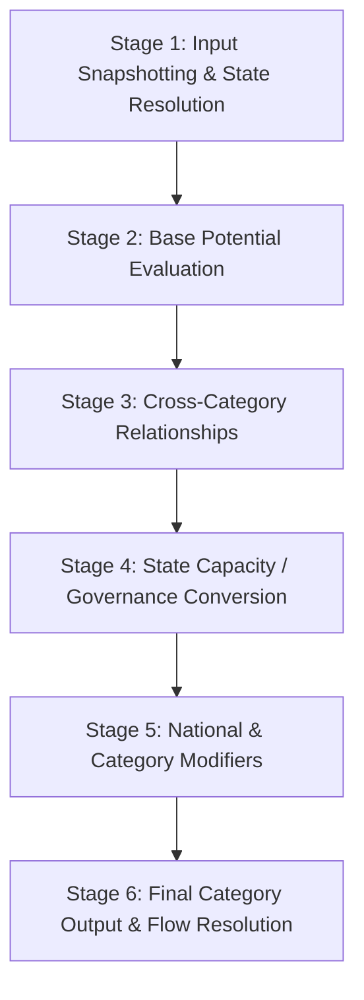

# ADR-0006: National Yield Calculation Rules Specification

## Status
Accepted (Specification Only)

## Context
Across Steps 1 to 4B, Republic established:
- The canonical design and core loop ([ADR-0001](file:///c:/Users/WALE/Republic%20-%20Game/Republic-Game/Docs/Architecture/Decisions/ADR-0001-canonical-delivery-model.md)).
- The authoritative global simulation clock in West Africa Time ([ADR-0002](file:///c:/Users/WALE/Republic%20-%20Game/Republic-Game/Docs/Architecture/Decisions/ADR-0002-global-simulation-clock.md)).
- Sovereign country identity and immutable founding moments ([ADR-0003](file:///c:/Users/WALE/Republic%20-%20Game/Republic-Game/Docs/Architecture/Decisions/ADR-0003-country-identity-and-founding-state.md)).
- The National Yield domain model across 14 canonical categories ([ADR-0004](file:///c:/Users/WALE/Republic%20-%20Game/Republic-Game/Docs/Architecture/Decisions/ADR-0004-national-yield-domain-model.md)).
- The National Yield calculation input contract and modifier model ([ADR-0005](file:///c:/Users/WALE/Republic%20-%20Game/Republic-Game/Docs/Architecture/Decisions/ADR-0005-national-yield-calculation-inputs.md)).

Before implementing the calculation engine in production code, this document establishes the **formal architectural specification** governing how National Yield calculations must function.

> [!IMPORTANT]
> **Specification-Only Scope Boundary**:
> This document defines architectural responsibilities, dependency flows, stages, and semantic contracts.
> It deliberately does **not** implement production calculation code, invent arbitrary numerical weights, pick final conversion ratios, execute yield cycles, or generate REPU.
> The calculation engine will determine the appropriate mathematical treatment and numerical calibration during the implementation phase.

---

## 1. What Is Being Calculated?

A central design failure of traditional nation-building games is treating all national outputs as a homogeneous pool of convertible points. Republic explicitly rejects this.

The calculation engine distinguishes between three fundamentally different concepts:

```
┌────────────────────────────────────────────────────────────────────────┐
│                        SOVEREIGN EVALUATION HIERARCHY                  │
├────────────────────────────────────────────────────────────────────────┤
│ 1. CAPACITY (Instantaneous Potential / Operating Level)                │
│    - What the country is currently capable of producing, sustaining,   │
│      or executing at this moment in time.                              │
│    - Examples: Industrial Capacity, Energy Capacity,                   │
│                Human Capital, Military Readiness.                      │
│    - Nature: Non-consumable operational ratings (NOT money).           │
├────────────────────────────────────────────────────────────────────────┤
│ 2. FLOW (Periodic Rate over Time)                                      │
│    - What is generated over a period of simulation time.               │
│    - Primary Example: REPU Treasury Revenue.                           │
│    - Nature: Dynamic generation rate per cycle or period.              │
├────────────────────────────────────────────────────────────────────────┤
│ 3. BALANCE / STOCK (Accumulated Reserves)                              │
│    - What accumulates over time and can subsequently be spent          │
│      or consumed.                                                      │
│    - Primary Example: Sovereign Treasury Balance in REPU (R).          │
│    - Nature: Liquid monetary stock.                                    │
└────────────────────────────────────────────────────────────────────────┘
```

### Key Distinctions
1. **National Yield Is Not Automatically Money**: The 14 National Yield categories represent distinct functional capabilities across economic, knowledge, institutional, and resource dimensions. They are not arbitrary currency pools.
2. **REPU Treasury Revenue vs. Treasury Balance**:
   - **REPU Treasury Revenue** is a **monetary flow** representing sovereign revenue generated over time from formal economic activity, state enterprise returns, tariffs, and sovereign assets.
   - **Treasury Balance** is the **accumulated monetary stock** of liquid REPU held by the state. Revenue flow feeds the treasury balance across elapsed simulation time.
3. **Food Exclusion Maintained**: Food is strictly an emergent output of the wider civilian economy (farmers + businesses + agriculture + infrastructure + energy + policy + markets), **not** a National Yield category or direct state deposit.

---

## 2. Category-to-Input Influence Mapping

The following mapping defines which inputs from [`NationalYieldCalculationInputs`](file:///c:/Users/WALE/Republic%20-%20Game/Republic-Game/src/Republic.Core/NationalYield/NationalYieldCalculationInputs.cs), country state, and institutional systems inform each of the 14 categories. Final numerical coefficients belong to subsequent engine implementation and calibration steps.

| # | National Yield Category | Primary Direct Inputs | Secondary / Indirect Influences | State Capacity / Institutional Modifiers |
|---|-------------------------|-----------------------|---------------------------------|------------------------------------------|
| 1 | **REPU Treasury Revenue** | Economic Capacity, Financial Capacity, Trade Volume | Infrastructure Condition, Human Capital, Natural Resource Output | Government Effectiveness (tax collection efficiency), Political Stability, Cabinet (Finance) |
| 2 | **Industrial Capacity** | Baseline Industrial Base, Energy Capacity | Infrastructure Condition, Natural Resource Output, Human Capital | Administrative Capacity, Science/Technology adoption, Cabinet (Infrastructure) |
| 3 | **Energy Capacity** | Power Plants, Grid Infrastructure, Fuel Output | Natural Resource Output (hydrocarbons, uranium), Technology | Infrastructure Condition, Environmental Regulations, Cabinet (Energy/Infrastructure) |
| 4 | **Infrastructure Capacity** | Transport Networks, Deepwater Ports, Rail Corridors | Industrial Capacity, Capital Investment | Administrative Capacity (maintenance bandwidth), Public Works Efficiency |
| 5 | **Financial Capacity** | Domestic Banking Capitalization, Sovereign Credit | Political Stability, Trade Volume, Currency Stability | Institutional Rule of Law, Corruption Perception, Cabinet (Finance) |
| 6 | **Human Capital** | Education Systems, Healthcare Quality, Demographics | Public Infrastructure, Food Security, Sanitation | Administrative Capacity (service delivery), Social Cohesion |
| 7 | **Science Capacity** | Academic Institutions, R&D Labs, Patent Base | Human Capital, Financial Investment | Freedom of Inquiry, Intellectual Property Protections, Cabinet (Science/Education) |
| 8 | **Innovation Capacity** | Commercial Tech Adoption, Entrepreneurial Activity | Science Capacity, Financial Capital Liquidity | Regulatory Modernism, Bureaucratic Red Tape (friction), Market Competition |
| 9 | **Administrative Capacity** | Civil Service Meritocracy, Bureaucratic Scale | Infrastructure (digital/telecom), Education Level | Anti-Corruption Strength, Government Effectiveness, Cabinet Competence |
| 10 | **Security Capacity** | Law Enforcement Personnel, Police Infrastructure | Political Stability, Human Capital | Judicial Independence, Rule of Law Enforcement, Cabinet (Interior) |
| 11 | **Intelligence Capacity** | Surveillance Networks, Cryptanalysis Facilities | Science/Tech (cyber/signals), Security Capacity | Administrative Integrity, Counter-Intelligence Doctrine, Cabinet (Defense/Interior) |
| 12 | **Military Readiness** | Armed Forces Training, Equipment Maintenance, Munitions | Industrial Capacity (fabrication), Energy, Logistics | Military Doctrine, Officer Competence, Cabinet (Defense) |
| 13 | **Diplomatic Capacity** | Diplomatic Corps Scale, Embassy Network, Soft Power | Cultural Standing, Trade Alliances, Financial Strength | International Legitimacy, Treaty Reliability, Cabinet (Foreign Affairs) |
| 14 | **Natural Resource Output** | Geological Reserves, Extraction Facilities | Infrastructure (logistics/freight), Energy Availability | Concession Management, Environmental Regulation, Security (site protection) |

---

## 3. Direct vs. Indirect Factors

The calculation engine must preserve a clean distinction between **direct drivers** and **indirect / upstream synergies**, without turning these relationships into premature mathematical percentages:

### Direct Factors
- **Direct drivers** represent the foundational physical, structural, or organizational capacity of a category.
- *Examples*:
  - Power generation infrastructure and grid throughput directly define **Energy Capacity**.
  - Operational manufacturing plants and fabrication facilities directly define **Industrial Capacity**.
  - Sovereign tax collection mechanisms applied to economic volume directly determine baseline **REPU Treasury Revenue**.

### Indirect & Upstream Factors
- **Indirect factors** operate as structural catalysts, enablers, or prerequisites.
- *Examples*:
  - **Science as an Upstream Driver**: Science does not directly fabricate industrial goods; rather, scientific research upgrades technology, which catalyses **Innovation Capacity**, improves agricultural productivity in the civilian economy, and raises **Industrial Capacity** efficiency.
  - **Infrastructure as a Logistic Enabler**: A nation may possess rich mineral deposits, but without transport networks, rail, and deepwater ports (**Infrastructure Capacity**), the realizable **Natural Resource Output** and resulting **REPU Treasury Revenue** are physically constrained.
  - **Energy as an Operational Enabler**: Without reliable grid power (**Energy Capacity**), modern industrial manufacturing and telecommunications infrastructure experience structural downtime.

The calculation engine will determine the appropriate mathematical treatment and scaling for these interactions during the implementation and calibration phase.

---

## 4. State Capacity Architecture

### Canonical Concept
> **State Capacity is the sovereign state's ability to convert resources, endowments, institutions, and executive decisions into productive real-world outcomes.**

State Capacity is the primary governance differentiator. Two countries with identical geographic territory, population scale, and natural resources will produce divergent outcomes based on their State Capacity.

### Contributing Components
State Capacity represents an integrated institutional capability derived from:
1. **Government Effectiveness**: Competence, speed, and organizational follow-through in executing public policy.
2. **Cabinet Ministerial Competence & Alignment**: Strategic caliber, domain expertise, and executive leadership of appointed ministers.
3. **Civil Service Integrity**: Meritocratic bureaucratic administration vs. corruption, rent-seeking, and administrative leakage.
4. **Rule of Law & Institutional Continuity**: Judicial stability, contract enforcement, and constitutional predictability.
5. **Political Stability**: Societal cohesion, civic legitimacy, and the absence of constitutional crises.

### Role in the Calculation Pipeline
In the calculation pipeline, State Capacity represents how effectively the country converts its available endowments, physical infrastructure, and policy decisions into realized national output. High State Capacity maximizes output from available endowments, whereas low State Capacity introduces administrative friction, policy delays, and institutional leakage.

The calculation engine will determine the specific mathematical formulation of this institutional conversion during the implementation and calibration phase.

---

## 5. Modifier Semantics Contract (`NationalYieldModifier`)

[`NationalYieldModifier`](file:///c:/Users/WALE/Republic%20-%20Game/Republic-Game/src/Republic.Core/NationalYield/NationalYieldModifier.cs) represents explicitly defined national modifiers originating from national traits, executive decrees, cabinet policies, bilateral treaties, or lifecycle conditions.

### Conceptual Contract
The property `NationalYieldModifier.Value` does **not** yet have a finalized mathematical interpretation. Future modifiers will conceptually express:
1. **Additive Influence**: Modifiers that introduce a baseline adjustment to capacity.
2. **Proportional Influence**: Modifiers that scale capacity relative to base potential.
3. **Efficiency / Conversion Influence**: Modifiers that adjust how effectively inputs are converted into output.
4. **Constraints (Floors / Ceilings)**: Modifiers that establish minimum baselines or regulatory/physical limits.
5. **Temporary Lifecycle Effects**: Modifiers tied to national developmental phases (such as the Founding Period).

### Provenance and Scope
- **Target Category**: Modifiers may target a specific category (`TargetCategory != null`) or apply across broad national capabilities (`TargetCategory == null`).
- **Source Tracking**: Modifiers record their institutional origin (`NationalTrait`, `ExecutiveDecree`, `CabinetMinistry`, `BilateralTreaty`, `LifecycleBuff`, `EmergencyMeasure`).

The calculation engine will define the precise combination rules, evaluation order, and stacking mathematics during the implementation phase.

---

## 6. Conceptual Calculation Pipeline

The calculation engine will organize its responsibilities across a clean, deterministic six-stage pipeline:



### Stage 1: Input Snapshotting & State Resolution
- **Responsibility**: Assemble authoritative country state, calculation inputs, and active modifiers for the evaluated nation. Ensure the evaluation operates on an isolated snapshot.

### Stage 2: Base Potential Evaluation
- **Responsibility**: Determine the country's underlying productive potential from its physical, human, economic, and institutional conditions.
- *Boundary*: Evaluates structural capability without applying ad-hoc multipliers.

### Stage 3: Cross-Category Relationships
- **Responsibility**: Allow upstream capabilities (such as Science, Energy, and Infrastructure) to inform and enhance dependent categories.
- *Boundary*: Evaluates structural synergies without locked-in numerical coefficients.

### Stage 4: State Capacity / Governance Conversion
- **Responsibility**: Evaluate how effectively the country converts available resources, institutions, and executive decisions into realized outcomes.
- *Boundary*: Applies governance and institutional effectiveness without premature multiplier formulas.

### Stage 5: National & Category Modifiers
- **Responsibility**: Apply applicable national traits, policy directives, cabinet effects, international treaties, and lifecycle rules.
- *Boundary*: Evaluates active modifier influences without hardcoded stacking mathematics.

### Stage 6: Final Category Output & Flow Resolution
- **Responsibility**: Finalize instantaneous capacity values on [`NationalYield`](file:///c:/Users/WALE/Republic%20-%20Game/Republic-Game/src/Republic.Core/NationalYield/NationalYield.cs) and resolve periodic flow rates (specifically **REPU Treasury Revenue**).
- *Boundary*: Emits deterministic results and telemetry without executing arbitrary financial mutations outside designated cycles.

---

## 7. Determinism Guarantees

Fair multiplayer simulation across all player-governed and AI-governed nations requires predictable, repeatable calculations:
1. **Reproducibility**: When supplied with identical country state, calculation inputs, active modifiers, and simulation time, the calculation engine must reliably produce the same result.
2. **Zero In-Engine Randomness**: `System.Random` or non-deterministic entropy is prohibited within core yield evaluation routines. Unpredictability in Republic emerges from player choices, political crises, and diplomatic interactions, never RNG in yield arithmetic.
3. **Canonical Ordering**: Active modifiers must be evaluated in a deterministic order (e.g. by `Id`) to prevent iteration-order variance.
4. **Side-Effect Free Evaluation**: The calculation stage must not mutate external world state during evaluation; state commits occur only during explicit synchronization phases.

---

## 8. Country Independence & Isolation

- **Isolated State Execution**: Calculation for Country A must never read, depend on, or mutate Country B's mutable domain state.
- **Explicit Interaction Contracts**: Cross-border interactions (such as bilateral trade, treaties, or sanctions) must enter a country's calculation strictly through explicit, localized inputs and verified modifiers.
- **Thread Safety**: Calculations for multiple sovereign nations must be safely executable in parallel.

---

## 9. Simulation Time & The Clock Relationship

The calculation engine synchronizes with the authoritative [RepublicClock](file:///c:/Users/WALE/Republic%20-%20Game/Republic-Game/src/Republic.Core/Time/RepublicClock.cs) operating in West Africa Time (WAT / UTC+1).

### Operational Time Boundaries
- **Instantaneous Capacity**: Evaluated at any simulation moment $t$ without advancing clock time, representing current operational capability.
- **Yield Cycles**: Standardized simulation intervals when periodic flows are calculated and committed.
- **Treasury Deposit**: When a yield cycle resolves, REPU Treasury Revenue generated over the elapsed interval is deposited into the country's sovereign treasury balance.

---

## 10. Founding Period Integration (Future Lifecycle Rule)

The canonical design specifies that newly founded nations receive a temporary **Founding Period** where National Yield is multiplied by **10** alongside targeted initial momentum buffs to enable players to establish baseline institutions and critical infrastructure.

### Architectural Placement
- The Founding Period is a **lifecycle rule** that will later modify National Yield calculations during the country's early founding window.
- The rule will be evaluated within **Stage 5 (Modifiers)** as an explicit lifecycle effect.
- **Status in Step 4C**: This rule remains strictly **unimplemented** at this stage. Exact modifier mechanics, duration, and transition behaviors will be calibrated during the dedicated founding lifecycle implementation.

---

## 11. Continuous Offline Progression (Future Subsystem Requirement)

Republic's canonical design establishes:
> **"Revenue is continuous. Development is continuous. Politics is continuous. The player is not."**

The persistent world continues to advance while an individual player is offline.

### Architectural Requirement
- The future simulation system must calculate the consequences of elapsed Republic time while the player is offline without requiring the player to remain connected.
- The precise catch-up and event-resolution mechanism will be defined by the future simulation and offline progression subsystem.
- Upon logging in, the delta of accumulated REPU revenue, completed projects, and capacity shifts will be compiled into the presidential **National Briefing**.
- **Status in Step 4C**: This subsystem remains **unimplemented** at this stage.

---

## Consequences
- Step 4C provides a clean, rigorous specification defining **what** the calculation engine must accomplish without prematurely dictating **how** the mathematical formulas must be implemented.
- Future developers retain full design freedom to calibrate balanced formulas, weights, and curves during Step 4D and beyond.
