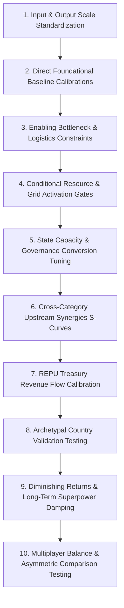

# ADR-0009: National Yield Numerical Calibration Framework

## Status
Accepted (Framework Only)

## Context
Across Steps 4A through 4E, Republic established:
- The foundational National Yield domain model across 14 canonical categories ([ADR-0004](file:///c:/Users/WALE/Republic%20-%20Game/Republic-Game/Docs/Architecture/Decisions/ADR-0004-national-yield-domain-model.md)).
- The calculation input contract and modifier representation ([ADR-0005](file:///c:/Users/WALE/Republic%20-%20Game/Republic-Game/Docs/Architecture/Decisions/ADR-0005-national-yield-calculation-inputs.md)).
- The six-stage calculation rules and architectural responsibilities ([ADR-0006](file:///c:/Users/WALE/Republic%20-%20Game/Republic-Game/Docs/Architecture/Decisions/ADR-0006-national-yield-calculation-rules.md)).
- The isolated, deterministic calculation engine with a minimal neutral baseline ([ADR-0007](file:///c:/Users/WALE/Republic%20-%20Game/Republic-Game/Docs/Architecture/Decisions/ADR-0007-isolated-national-yield-calculation-engine.md)).
- The sparse, semantically typed conceptual relationship map ([ADR-0008](file:///c:/Users/WALE/Republic%20-%20Game/Republic-Game/Docs/Architecture/Decisions/ADR-0008-national-yield-category-relationships.md)).

Step 4E defined **"what can influence what, and why"** while strictly deferring **"by how much."**

Before numerical formulas, equations, or coefficients are implemented in production code, Republic must establish the **governing mathematical calibration framework**.

This document answers:
> **"What kind of mathematical treatment should each relationship receive?"**
> Rather than:
> **"What exact coefficient or number should we choose?"**

> [!IMPORTANT]
> **Framework-Only Scope Boundary**:
> This document defines mathematical archetypes, scaling dimensions, boundedness constraints, diminishing return criteria, and validation personas.
> It deliberately does **not** pick specific numerical coefficients (e.g. `0.5`, `1000`, `10%`), implement calculation code, modify [`NationalYieldCalculator.cs`](file:///c:/Users/WALE/Republic%20-%20Game/Republic-Game/src/Republic.Core/NationalYield/NationalYieldCalculator.cs), or execute yield cycles.
> Actual numerical balancing and coefficient tuning remain explicitly deferred to subsequent calibration steps.

---

## Decision

Republic adopts a **bounded, monotonic, multi-dimensional calibration framework** to govern future numerical calculations across the six-stage calculation pipeline.

---

## 1. Core Calibration Principles

Any numerical formula implemented in future calibration steps must satisfy six inviolable principles:

### A. Determinism
Given identical input values on [`NationalYieldCalculationInputs`](file:///c:/Users/WALE/Republic%20-%20Game/Republic-Game/src/Republic.Core/NationalYield/NationalYieldCalculationInputs.cs) and identical modifiers:
- The calculation engine must evaluate the exact same numerical result every time.
- **Zero in-engine entropy**: `System.Random` is strictly prohibited.
- **Zero clock reliance**: The calculation engine must never query `DateTime.UtcNow` or system time.
- **Zero hidden state**: Calculations must be pure functions with zero static caching, global state, or cross-country memory.

### B. Boundedness
Simulation mathematics must prevent numerical instability, runaway compounding, and unmanageable divergence:
- **No Infinite Exponential Runaway**: Upstream improvements must never create unbounded compounding loops ($e^x$ or unchecked polynomial acceleration).
- **No Extreme Divergence**: A high-performing nation must not generate numbers so large that they break UI formatting, cause integer/float overflow, or render other countries mathematically irrelevant.
- **Non-Negativity Invariant**: Every National Yield capacity, output, and flow must remain $\ge 0.0$ at all times.

### C. Monotonicity
Systemic relationships must behave predictably and intuitively:
- **Directional Consistency**: Where an approved relationship is beneficial, increasing an upstream capability must never unintentionally decrease the downstream capability.
- **Explicit Friction**: If a negative trade-off or friction is intentionally designed (e.g. excessive bureaucracy causing red tape), it must be explicitly represented as a deliberate modifier or governance cost, never an accidental mathematical quirk of complex polynomial curves.

### D. Diminishing Returns
Real-world national capabilities experience diminishing marginal productivity:
- The 100th kilometer of highway or the 100th research lab in a saturated sector does not deliver the same transformative marginal gain as the 1st.
- Categories subject to technological saturation, logistical congestion, or bureaucratic overhead must incorporate sub-linear scaling (e.g. logarithmic, concave asymptotic, or bounded S-curve behavior) in their upper ranges.
- Linear scaling is permissible only across foundational baseline ranges or where physical output is directly additive.

### E. Thresholds & Activation Gates
Certain national systems cannot function in fractional increments:
- **Operational Baselines**: Running an electrified industrial manufacturing belt requires a minimum threshold of continuous energy and transport infrastructure. Below that threshold, industrial potential operates at severe baseline penalties.
- **Institutional Gates**: Extractive resources cannot generate sovereign royalties without minimum administrative customs apparatus and physical logistics corridors.
- Thresholds must be designed as smooth, bounded activation transitions rather than brittle step-functions that cause numerical oscillation.

### F. Capacity vs. Flow Rigor
The engine must strictly preserve the distinction between persistent capability and temporal generation:
- **Capacities** are persistent operational ratings/indices representing what the nation can sustain at any instant. They do **not** accumulate into sovereign bank balances.
- **Flows** (specifically REPU Treasury Revenue) represent dynamic generation rates evaluated over elapsed time.
- **Never Conflate Units**: A nation with `500.0` Industrial Capacity does not receive `500.0` REPU per cycle. Each dimension has distinct economic semantics.

---

## 2. Mathematical Treatment by Relationship Type

Building directly upon the controlled vocabulary established in [ADR-0008](file:///c:/Users/WALE/Republic%20-%20Game/Republic-Game/Docs/Architecture/Decisions/ADR-0008-national-yield-category-relationships.md), future calibration will map each relationship type to an approved mathematical archetype:

```
┌────────────────────────────────────────────────────────────────────────┐
│               MATHEMATICAL TREATMENT BY RELATIONSHIP TYPE              │
├────────────────────────────────────────────────────────────────────────┤
│ 1. DIRECT RELATIONSHIPS                                                │
│    - Mathematical Form: Bounded Linear or Monotonic S-Curve.           │
│    - Role: Forms the base substrate of the downstream category.        │
│    - Behavior: Directly increases base potential with saturation       │
│      damping at extreme upper bounds.                                  │
├────────────────────────────────────────────────────────────────────────┤
│ 2. ENABLING RELATIONSHIPS                                              │
│    - Mathematical Form: Bottleneck Constraints & Efficiency Factors.   │
│    - Role: Establishes operational throughput or capacity ceilings.    │
│    - Behavior: Acting like min(Demand, Throughput) or a smooth         │
│      asymptotic constraint. Severe penalties when upstream is near 0. │
├────────────────────────────────────────────────────────────────────────┤
│ 3. GOVERNANCE RELATIONSHIPS                                            │
│    - Mathematical Form: Realization Factor (Bounded Range [Floor, 1]). │
│    - Role: Governs institutional conversion and leakage attenuation.   │
│    - Behavior: Modulates how much structural potential translates into │
│      realized output. High governance approaches 1.0; low governance   │
│      experiences heavy administrative leakage toward a defined floor.  │
├────────────────────────────────────────────────────────────────────────┤
│ 4. CONDITIONAL RELATIONSHIPS                                           │
│    - Mathematical Form: Activation Gates & Prerequisite Multipliers.   │
│    - Role: Unlocks latent potential only when prerequisites exist.     │
│    - Behavior: Smooth logistic transition from 0 to full throughput    │
│      governed by the presence of prerequisite infrastructure or state. │
├────────────────────────────────────────────────────────────────────────┤
│ 5. EXTERNAL RELATIONSHIPS                                              │
│    - Mathematical Form: Exported Sovereign Metrics (Feed-Forward).     │
│    - Role: Provides capability ratings consumed by external systems.   │
│    - Behavior: Evaluated as standard internal capacities; external     │
│      diplomatic/military systems read these values without feeding     │
│      back into intra-tick yield arithmetic.                            │
└────────────────────────────────────────────────────────────────────────┘
```

---

## 3. Input Normalization & Scaling Model

[`NationalYieldCalculationInputs`](file:///c:/Users/WALE/Republic%20-%20Game/Republic-Game/src/Republic.Core/NationalYield/NationalYieldCalculationInputs.cs) accepts national factors representing the country's foundational conditions:
- `EconomicCapacity`
- `GovernmentEffectiveness`
- `InfrastructureCondition`
- `HumanCapital`
- `ScienceTechnology`
- `PoliticalStability`
- `SecurityLevel`
- `CabinetEffectiveness`

### Normalization Architecture
1. **Benchmark Scale (Standardized Sovereign Index)**:
   - For calibration purposes, baseline national inputs are conceptualized on a **standardized benchmark scale** (e.g. a nominal `0.0` to `100.0` range representing developing to advanced sovereign capability).
   - The contract supports values beyond `100.0` for hyper-specialized or late-stage superpowers, ensuring that the engine accommodates sovereign growth without artificial hard cutoffs.
2. **Input Immutability Preserved**:
   - The existing contract properties and types remain completely unchanged.
   - Stage 1 of the pipeline reads these inputs, validates non-negativity (`Math.Max(0.0, value)`), and maps them into internal calculation registers.

---

## 4. Output Normalization & Dimensionality

The 14 canonical categories do **not** share identical physical dimensions and must **never** be forced into a single homogeneous unit:

```
┌────────────────────────────────────────────────────────────────────────┐
│                   OUTPUT DIMENSIONS & MEASUREMENT SCALES               │
├────────────────────────────────────────────────────────────────────────┤
│ A. CAPABILITY INDICES (Dimensionless Sovereign Operational Ratings)    │
│    - Categories: Industrial Capacity, Infrastructure Capacity,         │
│      Human Capital, Science Capacity, Innovation Capacity,             │
│      Administrative Capacity, Security Capacity, Intelligence Capacity,│
│      Military Readiness, Diplomatic Capacity.                          │
│    - Meaning: Operational readiness, structural throughput, and        │
│      sovereign strength relative to global benchmarks.                 │
├────────────────────────────────────────────────────────────────────────┤
│ B. PHYSICAL / UTILITY CAPACITIES (Measurable Domestic Throughput)      │
│    - Categories: Energy Capacity (gigawatt/grid throughput index),     │
│      Financial Capacity (monetary depth/credit liquidity index).       │
│    - Meaning: Infrastructure-backed physical and financial bandwidth.  │
├────────────────────────────────────────────────────────────────────────┤
│ C. PHYSICAL EXTRACTIVE OUTPUT (Resource Flow / Volume)                 │
│    - Category: Natural Resource Output.                                │
│    - Meaning: Primary material volume extracted from territorial       │
│      deposits (ores, hydrocarbons, timber, agricultural bulk).         │
├────────────────────────────────────────────────────────────────────────┤
│ D. MONETARY FLOW (Sovereign Currency Rate)                             │
│    - Category: REPU Treasury Revenue.                                  │
│    - Meaning: Official currency generated per simulation cycle (R/c). │
│    - Feeds liquid treasury stock upon cycle completion.                │
└────────────────────────────────────────────────────────────────────────┘
```

---

## 5. Baseline & Zero-State Qualitative Behavior

To guarantee robustness across all possible gameplay states, future numerical formulas must conform to the following qualitative expectations:

| Input State | Qualitative Definition | Expected Mathematical Behavior |
|-------------|------------------------|--------------------------------|
| **Zero (`0.0`)** | Complete collapse or total absence of the sector. | Dependent downstream systems experience severe bottlenecking or fall back to survival baselines; zero raw resource processing; zero revenue from that sector. No negative outputs; no `NaN` or division by zero. |
| **Very Low** | Failed state, war-torn devastation, or pre-industrial baseline. | Severe administrative leakage; high logistics friction; basic subsistence economic activity without modern industrial throughput. |
| **Moderate** | Standard developing nation baseline. | Balanced operations; steady progress; modest industrial output; standard tax compliance; foundational institutional capacity. |
| **High** | Advanced industrialized republic. | Modern efficiencies; strong infrastructure; high technological adoption; emergence of initial diminishing returns on incremental investments. |
| **Extremely High** | Global superpower or hyper-specialized apex state. | Heavy diminishing returns; substantial maintenance overhead; high complexity; outputs approach asymptotic ceilings rather than accelerating exponentially. |

---

## 6. Category-Specific Calibration Framework Table

The following master table governs future numerical calibration for all 14 canonical categories:

| # | Category | Dimensional Type | Upstream Relationship Archetypes | Expected Mathematical Behavior | Primary Constraints / Ceilings | Diminishing Returns? | Threshold Gates? | Calibration Priority |
|---|----------|------------------|----------------------------------|--------------------------------|--------------------------------|----------------------|------------------|----------------------|
| 1 | **REPU Treasury Revenue** | Monetary Flow (`R/cycle`) | Industrial (`DIRECT`), Resources (`CONDITIONAL`), Finance (`ENABLING`), Admin (`GOVERNANCE`) | Multi-channel flow modulated by tax compliance and leakage attenuation factor. | Constrained by formal domestic turnover and fiscal integrity. | **Yes** (Extreme tax rates induce deadweight friction in macro models). | **Yes** (Minimum tax collection apparatus). | **Tier 3** (Final Flow) |
| 2 | **Industrial Capacity** | Capability Index | Energy (`ENABLING`), Infra (`ENABLING`), Natural Resources (`CONDITIONAL`), Innovation (`DIRECT`) | Heavy manufacturing throughput bounded by power availability and logistics corridors. | Bottlenecked by lowest enabling utility (Power or Logistics). | **Yes** (Capital saturation and plant maintenance limits). | **Yes** (Minimum energy grid connection). | **Tier 1** (Core Production) |
| 3 | **Energy Capacity** | Utility Capacity | Infra (`ENABLING`), Resources (`CONDITIONAL`), Innovation (`DIRECT`) | Generation capacity constrained by transmission grid bandwidth and primary fuel availability. | Capped by physical grid throughput and distribution lines. | **Yes** (Grid congestion and thermal distribution losses). | **Yes** (Fuel delivery and generation plant minimums). | **Tier 2** (Enabling Foundation) |
| 4 | **Infrastructure Capacity** | Capability Index | Industrial (`ENABLING`), Admin (`GOVERNANCE`), Finance (`ENABLING`) | Transport logistics and communication networks sustained by capital maintenance and industrial materials. | Constrained by civil public works maintenance bandwidth. | **Yes** (Network saturation and spatial geographic density). | **No** (Directly scalable civil assets). | **Tier 2** (Enabling Foundation) |
| 5 | **Financial Capacity** | Utility Capacity | Admin (`GOVERNANCE`), Security (`ENABLING`), Diplomatic (`EXTERNAL`) | Capital market depth and banking liquidity founded on institutional rule of law and civil peace. | Bounded by sovereign risk and legal contract certainty. | **Yes** (Market absorption capacity and liquidity saturation). | **Yes** (Minimum property rights security). | **Tier 2** (Enabling Foundation) |
| 6 | **Human Capital** | Capability Index | Admin (`GOVERNANCE`), Infra (`ENABLING`), Energy (`ENABLING`) | Population demographic skill and health resilience cultivated through public services. | Bounded by demographic population scale and education lead times. | **Yes** (Generational educational lead time limits). | **No** (Continuously progressive workforce baseline). | **Tier 1** (Core Substrate) |
| 7 | **Science Capacity** | Capability Index | Human Capital (`DIRECT`), Admin (`GOVERNANCE`) | Advanced research capability directly populated by educated intellect and academic freedom. | Constrained strictly by qualified academic human capital. | **Yes** (Research frontier difficulty increases non-linearly). | **Yes** (Minimum tertiary education base). | **Tier 2** (Knowledge Engine) |
| 8 | **Innovation Capacity** | Capability Index | Science (`DIRECT`), Finance (`ENABLING`), Human Capital (`ENABLING`) | Commercial technology adoption fueled by scientific breakthroughs and capitalized by venture credit. | Bottlenecked if venture capital or technical talent is absent. | **Yes** (Market technology absorption rates). | **Yes** (Minimum research or patent substrate). | **Tier 2** (Knowledge Engine) |
| 9 | **Administrative Capacity** | Governance Index | Human Capital (`DIRECT`), Security (`ENABLING`) | Institutional meritocracy and civil service competence; serves as the primary State Capacity engine. | Constrained by bureaucratic scale and anti-corruption integrity. | **Yes** (Bureaucratic expansion creates red tape overhead). | **Yes** (Baseline administrative survival threshold). | **Tier 1** (Core Governance) |
| 10 | **Security Capacity** | Governance Index | Admin (`GOVERNANCE`), Infra (`ENABLING`), Science (`ENABLING`) | Domestic law enforcement and civil order protecting property, infrastructure, and institutions. | Constrained by civil judicial integrity and population scale. | **Yes** (Oversized policing introduces social friction). | **Yes** (Minimum civil order to prevent anarchy). | **Tier 2** (Institutional Defense) |
| 11 | **Intelligence Capacity** | Capability Index | Admin (`GOVERNANCE`), Innovation (`DIRECT`), Diplomatic (`EXTERNAL`) | Threat early warning and counter-espionage powered by technological signals and foreign cover. | Constrained by operational secrecy and technical surveillance depth. | **Yes** (Diminishing tactical returns on marginal surveillance). | **Yes** (Minimum cryptanalysis / operational apparatus). | **Tier 3** (Strategic Posture) |
| 12 | **Military Readiness** | Capability Index | Industrial (`ENABLING`), Human Capital (`ENABLING`), Intelligence (`ENABLING`), Energy (`ENABLING`) | Armed forces combat posture and logistics; heavily consumes industrial munitions and trained personnel. | Constrained by industrial fabrication throughput and recruitment pool. | **Yes** (Force maintenance burden and economic drag). | **Yes** (Minimum armament and command readiness). | **Tier 3** (Strategic Posture) |
| 13 | **Diplomatic Capacity** | Capability Index | Admin (`GOVERNANCE`), Military (`ENABLING`), Finance (`EXTERNAL`) | Bilateral negotiating leverage and foreign representation backed by sovereign strength and institutional credibility. | Constrained by professional diplomatic corps scale and legitimacy. | **Yes** (Finite international attention and bilateral bandwidth). | **No** (Directly scalable diplomatic missions). | **Tier 3** (Strategic Posture) |
| 14 | **Natural Resource Output** | Extractive Volume | Infra (`ENABLING`), Energy (`ENABLING`), Admin (`GOVERNANCE`), Geological Endowment (`EXTERNAL_SYSTEM`) | Bulk primary extraction throughput governed by physical logistics corridors, power, and concession regulation. | Hard-capped by proven geological territorial reserves. | **Yes** (Resource deposit depletion and extraction friction). | **Yes** (Bulk transport corridor connection). | **Tier 1** (Core Extraction) |

---

## 7. Mathematical Anti-Patterns (What Must Never Happen)

To preserve architectural elegance and prevent game-balance degradation, the following practices are strictly forbidden:

1. **Arbitrary Numerical Conversions**:
   - `REPU Revenue = Economic Capacity * 1000` or similar arbitrary multipliers.
   - Flow generation must emerge from structured economic channels and tax compliance rules.
2. **Arbitrary Linear Averages**:
   - `Energy = (Infrastructure + Economic Capacity) * 0.5`.
   - Categories must be derived from actual causal substrates, not blended arithmetic averages.
3. **Hard-Coded Percentage Synergies**:
   - `Innovation += Science * 0.1` or `Industrial += Energy * 0.05`.
   - Upstream catalysts must behave as structured efficiency factors, capacity unblockers, or S-curves, not arbitrary flat percentage bumps.
4. **All-to-All Dense Networks**:
   - Every category mathematically modifying every other category.
   - Republic strictly enforces the sparse causal topology defined in ADR-0008.
5. **Intra-Tick Circular Calculations**:
   - Immediate mathematical recursion ($A \rightarrow B \rightarrow A$) within a single evaluation pass.
   - Every single-tick evaluation must execute as a strictly feed-forward Directed Acyclic Graph (DAG).
6. **Direct Science-to-Money Conversions**:
   - Science directly depositing REPU into the treasury. Science creates knowledge; enterprise creates wealth.
7. **Direct Military-to-Money Conversions**:
   - Military Readiness directly generating economic revenue. Defense consumes resources to protect the nation.
8. **Treating Food as National Yield**:
   - Food is strictly an output of the civilian farming economy and must never appear in National Yield calculations.
9. **Treating National Yield as a Single Composite GDP Score**:
   - Collapsing the 14 categories into a single scalar "Power Score."
10. **Universal Units Across All Categories**:
    - Treating 100 Industrial Capacity as identical or directly swappable with 100 REPU Revenue or 100 Natural Resources.
11. **RNG and System Clock Dependencies**:
    - Any use of `System.Random` or system time inside calculation logic.

---

## 8. Recommended Calibration Order

When actual numerical calibration commences in future steps, it must proceed through a disciplined, sequential order to maintain stability:



1. **Step 1: Input & Output Scale Standardization**: Establish formal benchmark ranges and unit dimensions.
2. **Step 2: Direct Foundational Baseline Calibrations**: Tune direct, 1:1 baseline relationships (`HumanCapital`, `IndustrialCapacity`, `AdminCapacity`).
3. **Step 3: Enabling Bottleneck & Logistics Constraints**: Calibrate how Energy and Infrastructure throttle industrial throughput.
4. **Step 4: Conditional Resource & Grid Activation Gates**: Calibrate extraction logistics and power plant prerequisites.
5. **Step 5: State Capacity & Governance Conversion Tuning**: Calibrate the administrative realization factor and leakage damping.
6. **Step 6: Cross-Category Upstream Synergies**: Calibrate non-linear S-curves for Science $\rightarrow$ Innovation $\rightarrow$ Industry.
7. **Step 7: REPU Treasury Revenue Flow Calibration**: Calibrate formal tax base turnover and treasury flow rates.
8. **Step 8: Archetypal Country Validation Testing**: Run the calibrated model against the 5 archetypal test personas.
9. **Step 9: Diminishing Returns & Long-Term Damping**: Verify that hyper-developed superpowers hit realistic diminishing returns.
10. **Step 10: Multiplayer Balance & Asymmetric Comparison**: Verify fairness, catch-up potential, and multi-path viability.

---

## 9. Archetypal Country Testing Requirements

Future numerical implementations must be validated against five distinct test personas to guarantee balanced outcomes across diverse national profiles:

### Archetype 1: The Fragile / Weak State
- **Profile**: Very low infrastructure, low administration, low security, modest natural resources.
- **Expected Outcome**:
  - Severe bottlenecking: heavy manufacturing and resource export are severely throttled by broken logistics.
  - High fiscal leakage: tax collection is deeply degraded by administrative weakness.
  - Non-zero survival baseline: basic localized output continues; no crashes or `NaN` values.

### Archetype 2: The Developing / Emerging Republic
- **Profile**: Moderate infrastructure, growing human capital, developing administration, modest industry.
- **Expected Outcome**:
  - Balanced progress: capital investments produce high marginal gains because the nation has not yet hit diminishing returns.
  - Clear developmental trade-offs: investing in energy visibly unblocks latent industrial capacity.

### Archetype 3: The Advanced Industrial Power
- **Profile**: High infrastructure, deep human capital, modern administration, established heavy industry.
- **Expected Outcome**:
  - Strong, stable output across all sectors with high administrative efficiency.
  - Marginal investments experience realistic diminishing returns, preventing exponential runaway.

### Archetype 4: The Resource-Rich Petrostates / Mining Enclave
- **Profile**: Massive natural resource endowments, weak domestic industry, moderate infrastructure, low science.
- **Expected Outcome**:
  - High primary resource output and significant state royalties (if export logistics exist).
  - Low innovation and high reliance on raw material flows; governance leakage limits broader institutional development.

### Archetype 5: The Specialized Knowledge / Tech Hub
- **Profile**: Exceptional science and human capital, modest heavy industry, low military, high financial depth.
- **Expected Outcome**:
  - High innovation capacity and strong financial services revenue.
  - Low raw industrial output and low military defense posture, requiring diplomatic alliances or trade to thrive.

---

## 10. Multiplayer Balance & Anti-Snowballing Principles

Republic is fundamentally a persistent multiplayer nation-building simulation. The numerical calibration framework must explicitly guard against runaway competitive distortion:

1. **Anti-Snowballing via Diminishing Returns**:
   - Early technological or economic advantages must not automatically produce permanent, insurmountable compounding superiority.
   - As a superpower expands, marginal yield gains diminish while structural maintenance costs rise.
2. **Asymmetric Viability (Multiple Valid National Paths)**:
   - A player focusing on high-tech innovation, financial depth, and diplomatic alliances must be competitively viable against a player building a massive industrial-military machine or a resource export titan.
3. **Strategic Opportunity Costs**:
   - Expanding military readiness or security must consume wealth and administrative bandwidth, imposing real economic trade-offs rather than acting as free power-ups.
4. **Catch-Up Dynamics**:
   - Developing nations investing in foundational infrastructure and education must enjoy high marginal efficiency, allowing smart governance and strategic trade to close developmental gaps over time.

---

## 11. Preserved Architecture & Strict Scope Boundary

The established architecture remains fully preserved:
- [`INationalYieldCalculator`](file:///c:/Users/WALE/Republic%20-%20Game/Republic-Game/src/Republic.Core/NationalYield/INationalYieldCalculator.cs) and [`NationalYieldCalculator`](file:///c:/Users/WALE/Republic%20-%20Game/Republic-Game/src/Republic.Core/NationalYield/NationalYieldCalculator.cs) remain completely **untouched**.
- The minimal neutral baseline established in Step 4D continues to serve as the operational execution engine.
- [ADR-0008](file:///c:/Users/WALE/Republic%20-%20Game/Republic-Game/Docs/Architecture/Decisions/ADR-0008-national-yield-category-relationships.md) remains the authoritative conceptual relationship map.
- External subsystems (tax policy, military combat, diplomacy, markets, food, geology, cabinet politics, yield cycles) remain strictly external.

---

## Consequences

- **Rigorous Mathematical Foundation**: Republic now possesses a complete, approved framework defining the mathematical archetypes, scaling dimensions, and constraints for all 14 categories.
- **Protection Against Balancing Traps**: Developers are prevented from introducing arbitrary linear averages, flat percentages, or unrealistic direct conversions.
- **Clear Roadmap for Step 4G & Beyond**: When numerical calibration begins, engineers and designers have an explicit 10-step sequence, 5 validation archetypes, and clearly defined boundaries to guide their work.
