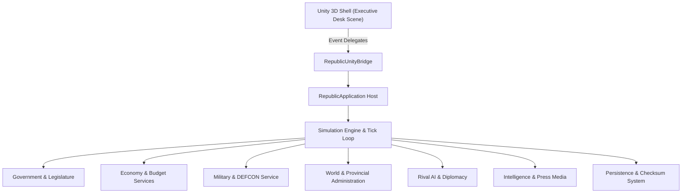

# Republic - Sovereign Strategy & Executive Simulation Engine

**Republic** is a comprehensive geopolitical strategy, economic simulation, and democratic governance game powered by a deterministic .NET 8.0 core and a Unity 3D executive suite presentation layer.

---

## High-Level Architecture Overview



---

## Subsystems & Features

### 1. Executive Government & Politics
* **Executive Orders & Decrees**: Issue presidential decrees under executive authority.
* **Cabinet Ministers**: Appoint and manage portfolio ministers (Finance, Defense, Foreign Affairs).
* **Constitutional Governance**: Propose and vote on constitutional amendments and legislative bills.

### 2. Economy & Regional Administration
* **Treasury & Taxation**: Adjust income tax rates, corporate tax policies, and monitor inflation.
* **Geography & Provinces**: Administer provincial territories (`ProvinceState`), invest in regional infrastructure, and manage local rebellion risk.

### 3. National Defense & Armed Forces
* **DEFCON Alert Levels**: Manage DEFCON 1 (Maximum Readiness) to DEFCON 5 (Peaceful Vigilance).
* **Military Branches**: Recruit troops and procure equipment for Army, Navy, Air Force, and Cyber Corps.
* **Strategic Directives**: Execute invasions, airstrikes, cyber attacks, blockades, and peacekeeping operations.

### 4. Rival AI, Diplomacy, & Intelligence
* **Autonomous Rival AI**: Foreign bots evaluate aggression, cooperation, and opportunism per turn tick.
* **Bilateral Treaties**: Propose, sign, or break military alliances, trade agreements, and non-aggression pacts.
* **Covert Operations**: Infiltrate foreign capitals, deploy covert assets, and conduct industrial sabotage.

### 5. Media, Telemetry, & Auto-Saves
* **Press Briefings**: Conduct press conferences and track public approval rating dynamics.
* **Campaign Telemetry**: Record turn-by-turn historical metrics for GDP trends, readiness, and public sentiment.
* **Save Integrity**: Automated tick auto-saves and SHA256 checksum signature verification.

---

## Quickstart & Launch Options

### Running the Interactive CLI Console

```bash
dotnet run --project src/Republic.Cli/Republic.Cli.csproj
```

### Standalone CLI Release Build (PowerShell)

```powershell
./build_cli.ps1 -Configuration Release
```

### Running Unit & Integration Tests

```bash
dotnet test Republic.sln
```

---

## Custom Scenario Modding Format

Place custom scenario `.json` files inside the `mods/` directory:

```json
{
  "id": "custom-scenario-01",
  "name": "The Solar Crisis",
  "description": "Navigate severe energy deficits and regional instability.",
  "playerCountryName": "Republic of Solaria",
  "startingTreasury": 5000000000.0,
  "startingStability": 65.0,
  "startingHappiness": 70.0,
  "neighboringCountries": ["Valeria", "Norse"],
  "primaryResourceNodes": ["Solar Energy Grid Alpha"]
}
```

---

## Project Structure

* `src/Republic.Core` — Deterministic game engine, domain models, services, and persistence.
* `src/Republic.App` — Application bootstrapper host and dependency injection container.
* `src/Republic.Cli` — Terminal dashboard, directive menus, and console game loop.
* `tests/Republic.Core.Tests` — Unit test suites (140+ passing tests).
* `unity/Scripts/Republic.Unity` — Unity presentation scripts, 3D desk raycaster, audio manager, UI controllers, and lighting effects.
